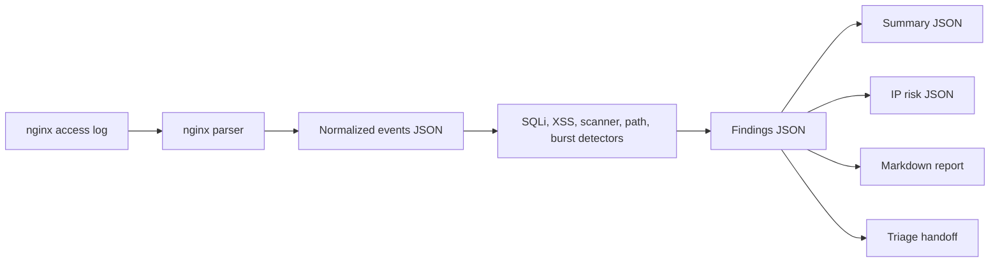

# Architecture

Web Attack Detection is a defensive nginx access-log lab for SQL injection, XSS, scanner user agents, sensitive path probing, and request bursts.

## Current MVP

- Parses nginx combined access logs.
- Decodes URL paths for deterministic pattern matching.
- Detects SQLi, XSS, suspicious scanners, sensitive path probing, and compact request bursts.
- Emits events, findings, summary, IP risk table, report, and triage artifacts.

## Future Product Shape

- Configurable detection windows and allowlists.
- Dashboard charts for attack types, source IPs, and endpoint frequency.
- Scheduled ingestion from safe lab logs or exported web server logs.
